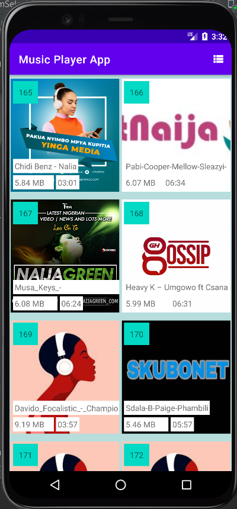
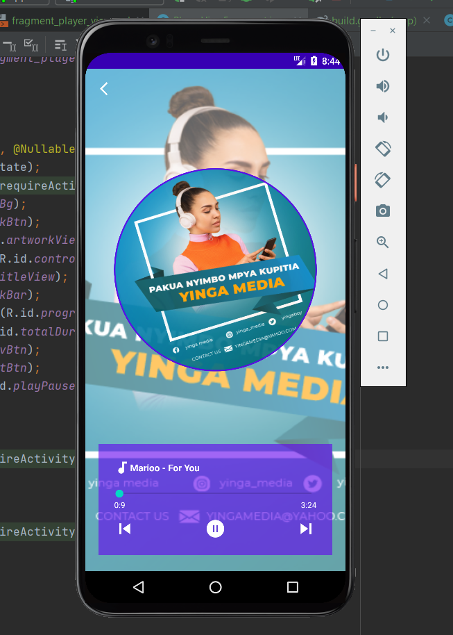

# MusicPlayerApp
Learn how to make real apps in android studio.
This is a complete Guidance towards making real music player app for android

Images of the app.

Video tutorials are on youtube (Coding Ton)

Music Player App Tutorials(3):

1. First tutorial (T1): Fetch device's songs & Showing/feeding them into the RecyclerView
https://www.youtube.com/watch?v=__r4T...

#TODO
- request runtime write storage permission (new way to request with ActivityResultLauncher)
- Fetch songs with Media store 
- Display songs in Recyclerview 
  .song title, duration, size
  .onclick item listener

2. Second tutorial(T2):  Playing Songs with Exoplayer
  https://youtu.be/STOxTqjaZew
 
 #TODO
 - adding the exoplayer dependency to build.gradle file module level
   implementation 'com.google.android.exoplayer:exoplayer:2.16.1'
- creating media media control button icons 
- Adding controls Buttons to the main layout file
-adding Exoplayer into our codes
-Exoplayer into songs adapter
-Creating Exoplayer mediaitems from list of songs
-playing a song on  item click
-displaying current playing song details to users
-next &previous skip buttons
-play/pause buttons

3. Third tutorial (T3): Player View with Exoplayer 
https://youtu.be/86f5-Mugw44

#TODO
- adding the fragment navigation & circular image view dependencies to build.gradle file module level
 implementation "androidx.navigation:navigation-fragment:2.3.5"  &
 implementation 'de.hdodenhof:circleimageview:3.1.0'
- adding the fragment container to  main app layout file
-creating a Player View Fragment
-setting Player View Fragment Layout Views
-creating Shared view model to share single instance of  our Exo Player between the Main Activity & and The Player View Fragment
-Launching Player View Fragment from Main Activity When Controls Wrapper is clicked
-Launching Player View From Songs Adapter when a song items is clicked to play
- getting the Player from shared view model in player view fragment
-working with player control button views (Seek bar, progress & total song duration, seek next & previous buttons, Play & Pause buttons)
-showing the current playing song artwork and setting an animation to it
-Playing and enjoying The Music Player app in android

Let us enjoy coding
